# Trading strategies around FOMC and macro releases

One place for every trading test in this project: what was tried, how it was tested, and what came
out. Each section names the script that produced it. The tables it writes are in `tables/` and the
figures in `figures/`.

## Bottom line

- **No strategy survived.** About 65 pre-specified trading rules were tested. None was profitable
  after bid/ask costs in both 2015-2022 (development) and 2023-2026 (holdout) with a confidence
  interval above zero.
- **Direction is not predictable** from price or order-book data after FOMC statements, press
  conferences or 8:30 macro releases, in a way that survives the chronological holdout.
- **Size is predictable.** A wider spread (and, in ZN, a thinner book) just before the news means a
  bigger move. This holds out of sample for macro releases. It is a volatility and position-sizing
  result, not a direction signal.
- **ES and NQ are almost perfectly in step at one second.** There is no lead long enough to trade,
  and the hedged spread's mean reversion (about +0.05 bp) is far smaller than the cost of four bid/ask
  crossings (about 0.6 bp).
- **Several 2015-2022 patterns faded after 2023:** stressed NQ moves reversing, the press conference
  reversing the statement, and ZN leading ES and NQ in the first seconds.
- **The one lead worth retesting on new events:** a large FOMC move in NQ made while the book is still
  stressed at +5 minutes partly reverses by +20 minutes.

| Test | Rules | Passed | One-line result |
|---|---|---|---|
| 1. FOMC +5 to +20 min strategies (ES, NQ, ZN) | 21 | 0 | Momentum fails; stressed NQ moves reverse instead |
| 2. Second-level order-book predictability | research | n/a | ZN imbalance predicts the next seconds, but moves are below one tick |
| 3. Stress -> fade on macro releases (minutes 1-5) | 4 rules x 3 markets | 1 (likely chance) | Reversal present before 2023, gone after |
| 4. Press conference vs statement (first 5 min) | 1 | 0 | No relation |
| 5. Pre-release liquidity -> size of move | regression | yes (macro) | Spread widening predicts bigger moves out of sample |
| 6. ZN leads ES/NQ in the first seconds | regression | no | Strong before 2023, gone since |
| 7. H5 with the order book instead of the surprise | regression | size yes, direction no | Book adds a little to the surprise for size; nothing for sign |
| 8. Statement vs full press conference | 7 | 0 | Every rule flips sign after 2022 |
| 9. ES/NQ lead-lag and pairs trading (one-second) | 5 rules x 3 groups x 5 periods | 0 | Spread barely mean-reverts; costs win every time |

## How every test was run

- **No look-ahead.** Decisions use only data timestamped at or before the decision time (for example
  +5:00). Entry fills at the book one second later. A long buys the ask and sells the bid; a short
  does the reverse. Fees are ignored for now; one extra tick per side is reported as a slippage check.
- **No surprise data in signals.** USMPD surprises and rate decisions are never used to choose trades.
  They appear only in clearly labeled after-the-fact tables.
- **Chronological split.** Development is 2015-2022 and holdout is 2023 onward. Every threshold,
  z-score, beta and regression coefficient is estimated on development only and frozen. The main
  FOMC holdout ran once under a hash lock (`output/fomc_strategy_holdout.lock`, zero overrides).
- **Events are the unit.** Standard errors are clustered by event; confidence intervals come from an
  event bootstrap (10,000 draws).
- **Verdict rule, fixed in advance.** SUPPORTED = positive after costs in development and in the
  holdout, at least 3 holdout trades, and a full-sample 95% CI above 0. WEAK EVIDENCE = positive in
  both, but the CI includes 0 or the holdout has fewer than 3 trades. NOT SUPPORTED = anything else.
- **Disclosure.** Earlier descriptive work (H4-H6) had already looked at group averages across all
  meetings, including 2023-2026. No strategy had been run on any period before these tests.

---

## 1. FOMC strategies: does the book at +5 minutes say whether the first move continues?

Script: `scripts/build_fomc_strategy_features.py`, `scripts/run_fomc_strategy_tests.py`,
`scripts/make_fomc_strategy_report.py`. Data: one-second MBP-1 book, 92 statements (63 development,
29 holdout). Decision at +5:00, entry +5:01, exit +20:00 (robustness exits +10 and +30).
Registry: `output/strategy_registry.csv`; frozen parameters: `output/fomc_strategy_frozen_params.json`.

Features (all known at +5:00): first-move returns at 30 s, 1, 3 and 5 min; depth and spread ratios
(30-second trailing mean against the -240 to -61 s baseline); bid/ask depth; imbalance; recovery from
+1 to +5 min. Liquidity stress = z(1 - depth ratio) + z(spread ratio - 1).

| Strategy | Idea | Result |
|---|---|---|
| P1 price momentum | Follow a large first move (top quarter of development moves) | ES -9.0 / -5.6 bp, NQ -12.2 / -14.5 bp (development / holdout); ZN flat. Fails |
| P2 large move + stressed book -> follow | A thin book means the news is not absorbed yet | Worst rule. NQ -30.5 / -37.2 bp, full sample -32.0, 95% CI [-53, -10]. The move reverses |
| P3 large move + recovered book -> fade | Recovered liquidity means overshoot | 13 trades in 92 meetings, 2 in the holdout. Too few to judge |
| S2 NQ depth-only / spread-only stress | Which part of the NQ book carries the signal | -41 / -31 bp. Fail |
| S4 fast / slow recovery | Recovery speed decides fade vs follow | Mixed, insignificant |
| S5 ES + NQ agree (with / without stress) | Two markets confirming each other | -10 to -22 bp. Fail |
| S6 ES + NQ + ZN agree | Coherent three-market reaction | About zero, very few trades |
| S7 ES/NQ relative value | Bet that a large NQ-vs-ES gap closes | About zero |
| S8 (= P1, P2 on ZN) | ZN momentum | Flat |
| S9 ZN depth refill at +10 min | Fade if refilled, follow if still thin | Both lose |
| Exits at +10 and +30 min | Robustness of P1-P3 | Same conclusions |

**Regressions.** Liquidity alone (depth, spread, recovery, stress) is insignificant in every market
and sample. The only consistent signal is the interaction of move size and stress in NQ: -0.17
(full sample, p = 0.01). Large moves made while the NQ book is stressed partly reverse. This is the
opposite of what P2 assumed.

**Costs.** The median bid/ask cost per round trip is about 0.7 bp (ES, NQ) and 1.3 bp (ZN). One extra
tick per side adds 1.3 / 0.4 / 2.6 bp. The losing rules lose 10-40 bp a trade, so the failures come
from the signal, not from costs.

Continuation after +5 min by liquidity state (states from frozen development thresholds):

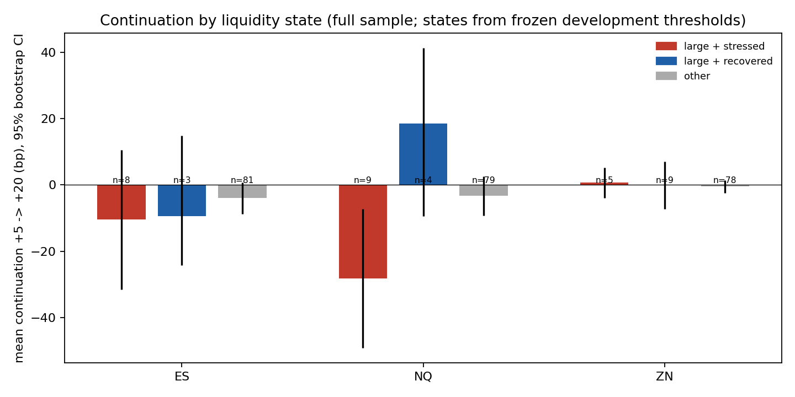

Price-only momentum (P1) against price + stress (P2) and recovery fade (P3), development vs holdout:

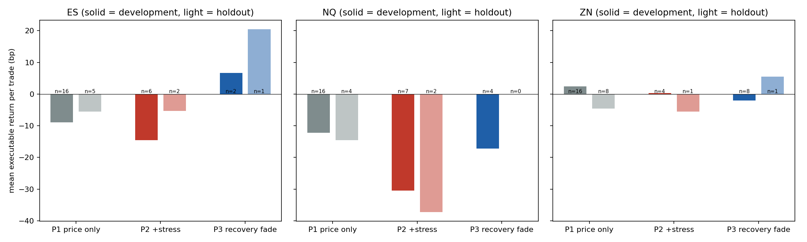

Every registered strategy, development against holdout (points near the diagonal and above zero
would be robust; there are none in the upper right):

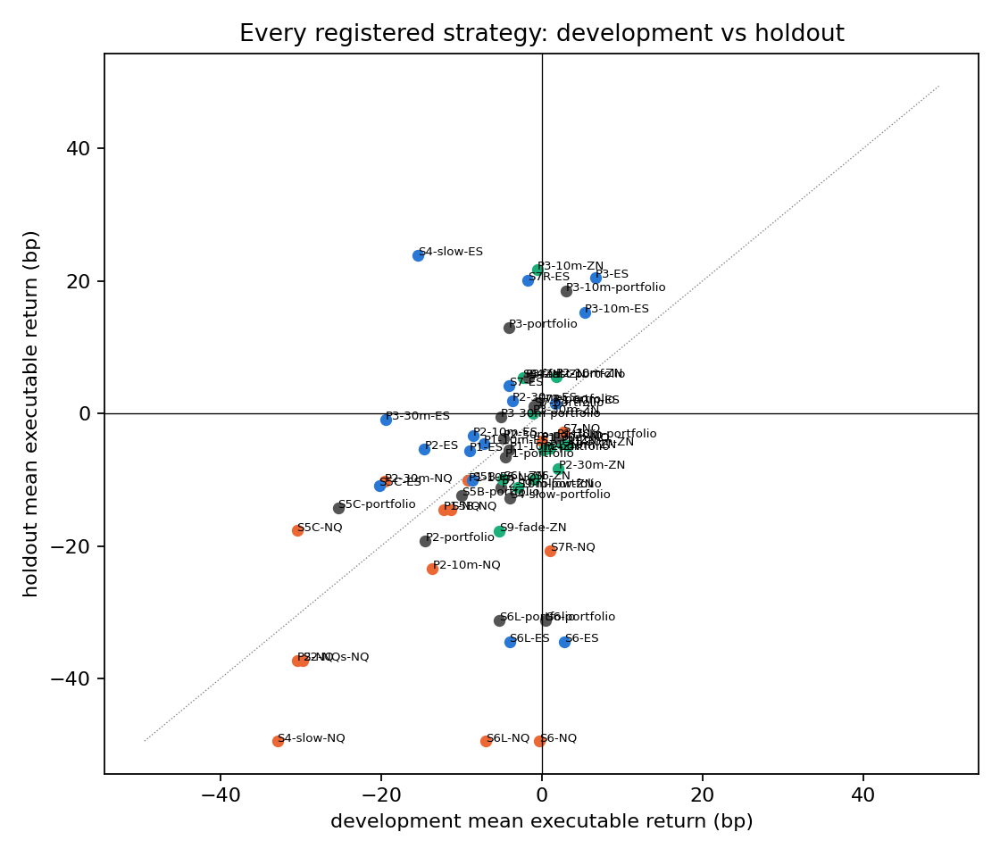

Cumulative profit of every strategy (shaded = holdout):

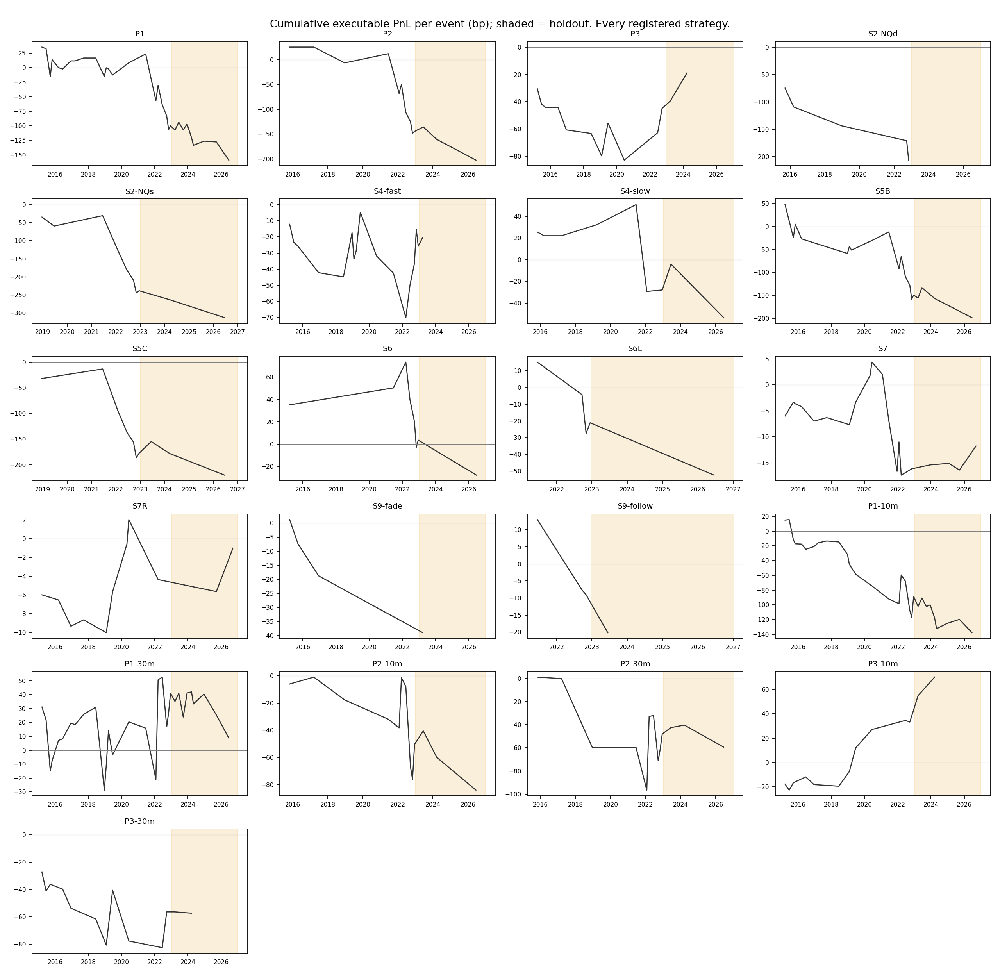

Depth paths of events that continued vs reversed after +5 min (labels are after the fact). ZN depth
overshoots its baseline from +10 to +30 min, more after moves that continued:

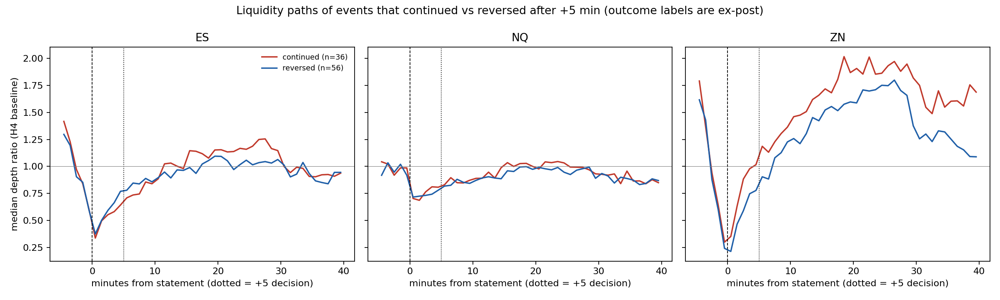

After the fact, by USMPD surprise third (not used in any strategy): equity moves lean slightly
toward reversal after +5 min whatever the surprise size.

| Market | Surprise third | N | Mean continuation +5 to +20 (bp) | Median |
|---|---|---|---|---|
| ES | small / medium / large | 31 / 30 / 31 | -4.6 / -7.4 / -2.2 | -1.9 / -6.5 / -4.9 |
| NQ | small / medium / large | 31 / 30 / 31 | -5.0 / -8.3 / -1.1 | -2.4 / -5.7 / -4.6 |
| ZN | small / medium / large | 31 / 30 / 31 | -2.0 / -0.4 / +1.3 | -1.4 / -0.0 / +1.3 |

## 2. Second-level order-book predictability (research test, S10)

Same script, `tables/fomc_microstructure_predictability.csv`. Every second from +1 to +29 min, the
change in depth, bid/ask size, imbalance and spread over the last 5-60 s predicts the next 5, 30 and
60 s mid return. Fitted on development, scored on the holdout.

- The 5-second change in imbalance is significant in all three markets (p < 0.001).
- Out of sample it works only in ZN: R2 4-8% at 5 s, about 1% at 30-60 s. In ES and NQ it is about 0.
- The predicted moves are smaller than one tick and fall inside the bid/ask spread. This is the
  large-tick queue-imbalance effect, not a strategy you can trade by crossing the spread.

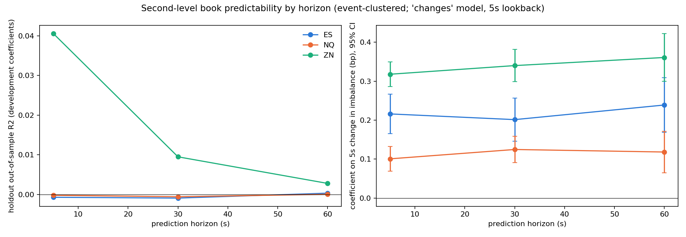

## 3-6. Follow-up ideas on 432 macro releases and the FOMC event table

Script: `scripts/run_followup_ideas.py`. Data: `data/processed/tick_features/events.parquet`
(macro: 284 development / 148 holdout releases; FOMC: 92 statements, 76 press conferences). Tables:
`tables/followup_*.csv`. Costs are approximate (average quoted spread at entry and exit).

### 3. Stress -> fade at the minute scale (decide +1 min, exit +5 min)

| Events | Rule | Market | Development | Holdout | Full sample (95% CI) | Verdict |
|---|---|---|---|---|---|---|
| Macro | large + stressed -> fade | ES | -7.3 (33) | +2.3 (67) | -0.9 [-4.9, +3.2] | NOT SUPPORTED |
| Macro | large + stressed -> fade | NQ | +2.7 (14) | +0.5 (28) | +1.2 [-7.2, +10.5] | WEAK |
| Macro | large -> follow | all | +3.7 (108) | -2.2 (103) | +0.8 [-1.6, +3.2] | NOT SUPPORTED |
| Macro | large + calm -> follow | ES | +6.9 (38) | +9.9 (6) | +7.3 [+2.1, +12.4] | SUPPORTED* |
| FOMC | large + stressed -> fade | NQ | -37.1 (7) | -2.3 (10) | -16.6 [-30.4, -3.8] | NOT SUPPORTED |
| FOMC | large -> follow | ES | +8.3 (16) | +2.6 (12) | +5.9 [-4.3, +15.6] | WEAK |

\*1 of 28 rows; 6 holdout trades; not confirmed in NQ or ZN. About what chance gives at 5%. This
rule was in the code before the run but was left out of the written spec by mistake.

- Macro, move size x stress: -0.071 (p = 0.003) in development, -0.002 (p = 0.89) in the holdout.
  The reversal pattern was real before 2023 and disappeared.
- At FOMC the first five minutes show the opposite: large moves continue from +1 to +5 min, more when
  the book is stressed (+0.13, p = 0.006). Combined with section 1, FOMC moves overshoot during
  minutes 1-5 and partly unwind afterwards. Neither leg is reliable enough to trade.

### 4. Press conference vs statement (first 5 minutes)

The press-conference 0-5 min return is unrelated to the statement move (slopes -0.02 to -0.01,
p > 0.8). Fading the statement move at the press-conference start nets +1.7 / -1.3 / -1.6 bp. Not
supported. Section 8 extends this to the whole press conference.

### 5. Pre-release liquidity -> size of the move

ln(1 + |return|) on the depth ratio and spread change in the minute before the release, with event
type x market fixed effects:

- Spread widening predicts a bigger move in every market (full sample: ES +0.48, NQ +0.12, ZN +1.15
  per tick, all p < 0.01).
- Depth works as predicted only in ZN: a thinner book means a bigger move (p = 0.004).
- Out of sample, adding liquidity improves the holdout fit by 0.15-0.21 R2 over fixed effects alone.
  This holds for macro releases, not for FOMC (92 events).

### 6. ZN leads ES and NQ in the first seconds

| Leader -> target | Development | Holdout | Holdout R2 (with leader / own lag only) |
|---|---|---|---|
| ZN -> ES | +1.05 (p = 0.001) | +0.19 (p = 0.16) | -1.42 / -0.15 |
| ZN -> NQ | +1.45 (p = 0.001) | +0.28 (p = 0.13) | -1.62 / -0.35 |
| ES -> NQ | +0.87 (p = 0.14) | +0.90 (p = 0.002) | -0.11 / -0.35 |

The ZN lead weakened after 2022, and using it makes holdout forecasts worse.

## 7. H5 with the order book instead of the surprise

Script: `scripts/analyze_h5_liquidity.py`; table `tables/h5_liquidity_regressions.csv`. Same 92
statements and horizons (1 s to 30 min) as H5. Book variables are measured before the statement.

| | ES | NQ | ZN |
|---|---|---|---|
| Size: per +1 tick of pre-statement spread | +14 to +16 bp at 5 s-1 min (p < 0.01) | about +1 bp | +9 to +11 bp at 5-30 s |
| R2 of size, book only | 0.16 at 5 s, 0.06-0.10 to 10 min | 0.03-0.08 | 0.04-0.08 |
| R2 of size, surprise only (H5a), 5 s on | 0.16-0.40 | 0.19-0.36 | 0.26-0.52 |
| Direction: R2 from bid/ask imbalance | below 0.01 | up to 0.12 | below 0.06 |
| Direction: R2 from the signed surprise, 5 s on | 0.4-0.6 | 0.4-0.5 | 0.5-0.76 |

On macro releases the book alone explains 0.13-0.34 of the size of the move, about twice as much as
at FOMC. The book tells you how big the news will be, not which way it goes.

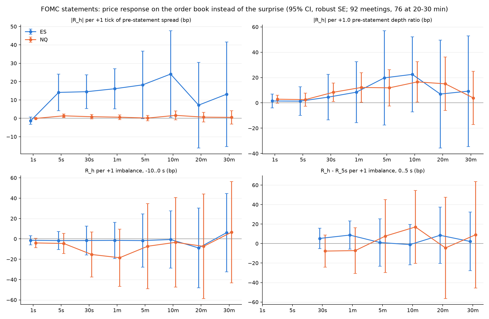

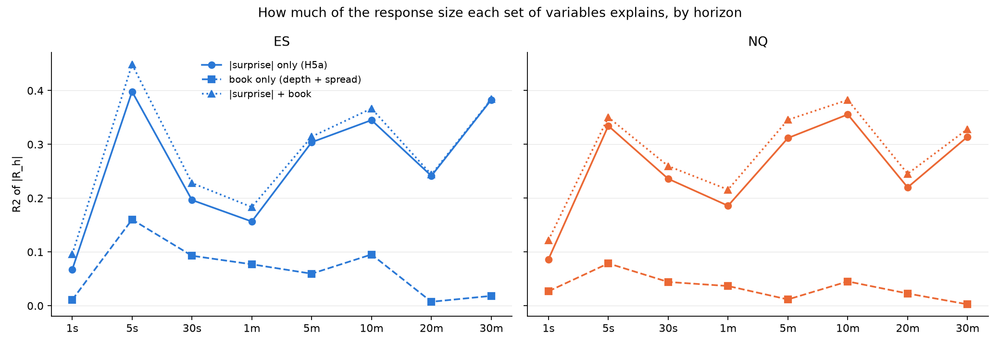

## 8. Statement vs the full press conference

Script: `scripts/analyze_statement_vs_pc.py`; tables `tables/statement_pc_*.csv`. Data: one-second
BBO session panel. 75 meetings with a press conference (47 / 28), 16 without one, 174 control days on
the same clock.

| Correlation (ES / NQ / ZN) | 2015-2022 | 2023-2026 | All years | Control days |
|---|---|---|---|---|
| Press conference first 15 min ~ statement 0-30 min | -0.31 / -0.29 / -0.03 | +0.04 / -0.01 / +0.29 | -0.24 / -0.24 / +0.08 | +0.08 / +0.02 / +0.11 |
| Press conference full hour ~ statement 0-30 min | -0.15 / -0.22 / -0.05 | +0.31 / +0.29 / +0.32 | -0.06 / -0.12 / +0.09 | +0.09 / +0.05 / -0.07 |

| Rule (executable bp, development / holdout) | ES | NQ | Verdict |
|---|---|---|---|
| Fade the statement move at the press-conference start, exit +60 min | +2.4 / -6.4 | +10.1 / -21.6 | Flips sign |
| Same, large statement moves only | +29 / -38 | +48 / -98 | Flips sign (2-4 holdout trades) |
| Follow the press conference's first 15 min to +60 min | +12.9 / -3.5 | +27.1 / -10.8 | Flips sign; development profit mostly 2022 |

The robust fact is descriptive: the median absolute move from +30 to +90 min is 38 / 43 / 16 bp
(ES / NQ / ZN) on press-conference days, against 11 / 17 / 3 bp on control days and 16 / 18 / 4 bp on
meetings without a press conference. The press conference is a second, larger news event whose
direction cannot be read from the statement window.

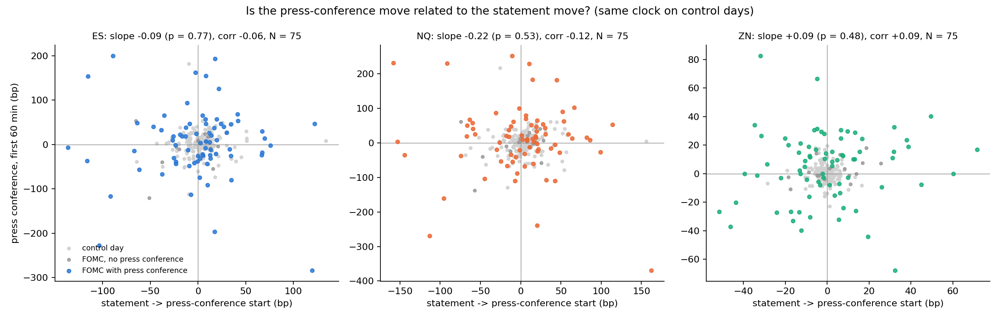

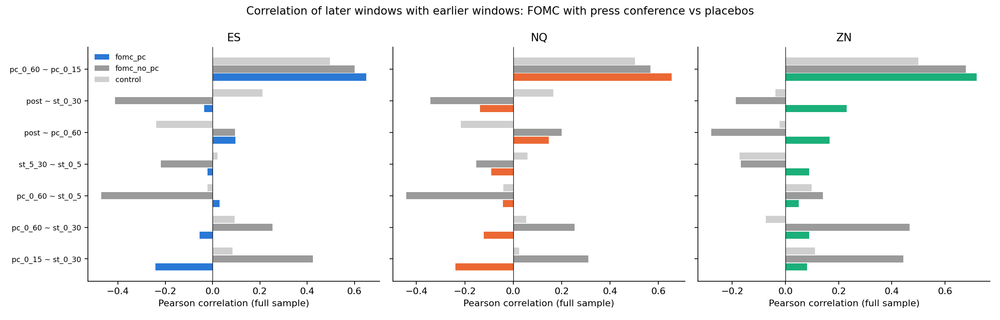

## 9. ES/NQ lead-lag and pairs trading (one-second session panel)

Script: `scripts/analyze_es_nq_pairs.py` (specification in its docstring, written before the run).
Tables: `tables/es_nq_*.csv`. Same session panel as section 8: 75 meetings with a press conference
(47 / 28), 16 without one, 174 control days.

**Lead-lag.** ES and NQ move together within the same second: the same-second correlation of
one-second returns is 0.70 on control days and 0.85-0.90 on FOMC days, and has risen to 0.94-0.95
since 2023. Correlations one second apart are about 0.02 in every period and group. The only visible
lead appears in the first five minutes after a statement in 2015-2022 (about 0.05-0.09, in both
directions, which points to stale quotes rather than one market leading). It is gone in 2023-2026.

In regressions, last second's NQ return predicts next second's ES return (+0.19 on control days,
p < 0.001, holdout out-of-sample R2 1.2%). ES's lag predicts NQ much less (+0.03 to +0.08). ES has
a large tick, so its midpoint updates in jumps and lags NQ's finer-grained price by a second or so.
The out-of-sample R2 on FOMC days is below 0.1%, and the effect fades by 5-30 s.

**Strategies** (executable bp per session, all phases after 0; s = sessions, t = trades):

| Rule | FOMC with press conference, dev / holdout | Control days, dev / holdout | Mid-price gross (FOMC) | Verdict |
|---|---|---|---|---|
| Pairs: 60 s signal, 5 min hold | -0.73 / -0.37 (1,532 trades) | -0.57 / -0.43 | +0.05 | NOT SUPPORTED |
| Pairs: 30 s signal, 1 min hold | -0.69 / -0.46 (6,306 trades) | -0.62 / -0.35 | +0.03 | NOT SUPPORTED |
| Pairs: 5 min signal, 15 min hold | -0.72 / -0.47 (485 trades) | -0.28 / -0.48 | +0.07 | NOT SUPPORTED |
| Lead-lag: big ES 5 s move, buy/sell NQ, 5 s hold | -0.73 / -1.44 | -0.80 / -0.90 | -0.15 | NOT SUPPORTED |
| Lead-lag: same, 30 s hold | -0.17 / -0.61 | -0.31 / -1.22 | +0.42 | NOT SUPPORTED |

- The hedged ES/NQ spread does mean-revert, but by only +0.03 to +0.25 bp at the mid. Four
  crossings of the bid/ask cost about 0.6 bp, so every configuration loses, on FOMC days and on
  ordinary days alike.
- By the time an order fills one second later, NQ has already caught up with a big ES move.
- 3 of 60 rule x group x period cells are WEAK EVIDENCE: for example the 5-minute pairs rule entered
  between +5 and +30 min (+0.51 / +0.45 bp, p = 0.37). That is about what chance gives.
- Making this work would need passive (limit-order) execution, which would save most of the 0.6 bp,
  and a queue-position model to simulate fills. That is outside what this data can test.

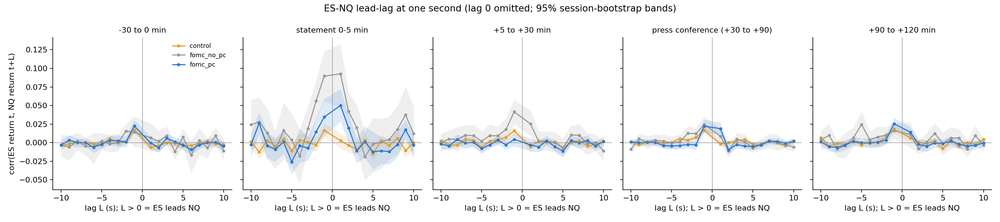

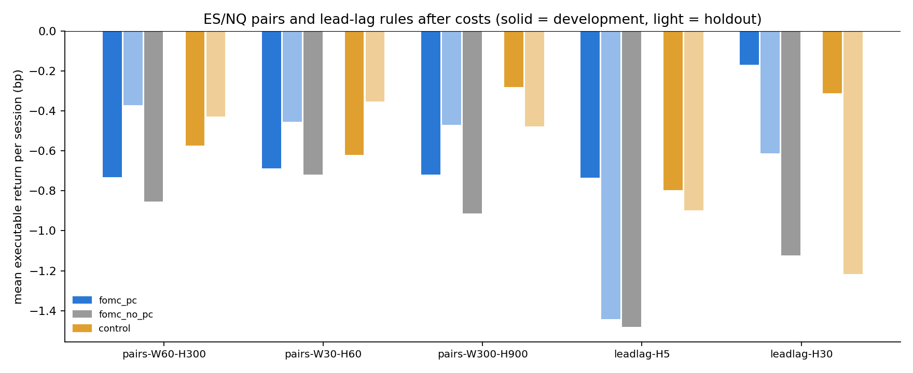

---

## What to do next

1. Register "large stressed NQ move -> fade at +5 min" now (P2 thresholds, direction flipped) and test
   it only on events not yet seen: future FOMC meetings, or CPI/NFP with the same one-second book.
2. Build on the size result: a pre-release volatility forecast (spread, depth) for macro releases,
   evaluated as a sizing or options signal rather than a direction trade.
3. The pre-FOMC drift (Lucca and Moench) is the one idea not yet run; it needs one-minute ES bars.
4. Document the 2023 regime change as a finding: several pre-2023 relationships weakened or vanished.

## Appendix A: pre-specified rules for the follow-up tests (written before those runs)

- Events: FOMC statements (93), press conferences (77), and CPI, PPI, employment and retail-sales
  releases at 8:30 ET (435); ES, NQ, ZN. Degraded data and invalid pre-event books dropped.
- Test 3: decision at +60 s. Large = |return 0-60 s| >= development 75th percentile (per market).
  Stress at +60 s = z(1 - depth ratio, 0-60 s) + z(spread change, 0-60 s); stressed = development
  75th percentile. Rules: large + stressed -> fade; large -> follow; large + calm -> follow (the last
  was in the code but missing from the original text). Hold +60 to +300 s. Regression of
  continuation on |move|, stress and their product; prediction: negative product.
- Test 4: press-conference 0-5 min return and the statement +5 to +30 min drift, each regressed on
  the statement 0-5 min move; prediction: negative.
- Test 5: ln(1 + |return 0-60 s or 0-300 s|) on the pre-60 s depth ratio and spread change with event
  type x market fixed effects; prediction: negative depth, positive spread coefficient; holdout R2
  against fixed effects alone.
- Test 6: target 5-60 s return on the leader's 0-5 s return, controlling for the target's own;
  prediction: ZN leads ES and NQ.
- Test 8 (statement vs press conference): see the docstring of `scripts/analyze_statement_vs_pc.py`.

## Appendix B: full results of the FOMC strategy test (section 1)

Mean executable return per trade in bp (number of trades); full-sample event-bootstrap 95% CI.
Fees ignored. The `-10m` / `-30m` suffix marks the robustness exits.

| Strategy | Market | Development | Holdout | Full sample (95% CI) | Verdict |
|---|---|---|---|---|---|
| P1 | ES | -9.0 (16) | -5.6 (5) | -8.2 (21) [-20.6, +4.0] | NOT SUPPORTED |
| P1 | NQ | -12.2 (16) | -14.5 (4) | -12.6 (20) [-29.4, +4.2] | NOT SUPPORTED |
| P1 | ZN | +2.4 (16) | -4.6 (8) | +0.1 (24) [-4.1, +4.1] | NOT SUPPORTED |
| P1 | portfolio | -4.6 (22) | -6.5 (9) | -5.1 (31) [-13.9, +2.9] | NOT SUPPORTED |
| P2 | ES | -14.6 (6) | -5.3 (2) | -12.3 (8) [-33.7, +8.8] | NOT SUPPORTED |
| P2 | NQ | -30.5 (7) | -37.2 (2) | -32.0 (9) [-53.2, -10.2] | NOT SUPPORTED |
| P2 | ZN | +0.3 (4) | -5.6 (1) | -0.9 (5) [-5.9, +4.1] | NOT SUPPORTED |
| P2 | portfolio | -14.5 (10) | -19.3 (3) | -15.6 (13) [-32.9, +0.6] | NOT SUPPORTED |
| P3 | ES | +6.7 (2) | +20.5 (1) | +11.3 (3) [-15.9, +29.2] | WEAK EVIDENCE |
| P3 | NQ | -17.2 (4) | no trades | -17.2 (4) [-40.9, +11.2] | NOT SUPPORTED |
| P3 | ZN | -2.0 (8) | +5.4 (1) | -1.2 (9) [-8.0, +6.0] | NOT SUPPORTED |
| P3 | portfolio | -4.1 (11) | +13.0 (2) | -1.5 (13) [-11.2, +8.2] | NOT SUPPORTED |
| S2-NQd | NQ | -41.2 (5) | no trades | -41.2 (5) [-58.6, -30.3] | NOT SUPPORTED |
| S2-NQs | NQ | -29.8 (8) | -37.2 (2) | -31.3 (10) [-50.9, -11.1] | NOT SUPPORTED |
| S4-fast | ES | +6.0 (7) | no trades | +6.0 (7) [-9.3, +20.6] | NOT SUPPORTED |
| S4-fast | NQ | -3.6 (7) | no trades | -3.6 (7) [-20.9, +14.6] | NOT SUPPORTED |
| S4-fast | ZN | -2.3 (9) | +5.4 (1) | -1.6 (10) [-7.9, +5.3] | NOT SUPPORTED |
| S4-fast | portfolio | -1.6 (16) | +5.4 (1) | -1.2 (17) [-9.2, +6.9] | NOT SUPPORTED |
| S4-slow | ES | -15.4 (4) | +23.9 (1) | -7.6 (5) [-40.3, +21.4] | NOT SUPPORTED |
| S4-slow | NQ | -32.9 (2) | -49.4 (1) | -38.4 (3) [-94.6, +28.8] | NOT SUPPORTED |
| S4-slow | ZN | +8.6 (4) | no trades | +8.6 (4) [+0.7, +17.6] | NOT SUPPORTED |
| S4-slow | portfolio | -4.0 (7) | -12.8 (2) | -5.9 (9) [-30.5, +13.5] | NOT SUPPORTED |
| S5B | ES | -8.6 (15) | -10.1 (4) | -8.9 (19) [-22.8, +4.1] | NOT SUPPORTED |
| S5B | NQ | -11.3 (15) | -14.5 (4) | -12.0 (19) [-30.0, +4.8] | NOT SUPPORTED |
| S5B | portfolio | -10.0 (15) | -12.3 (4) | -10.5 (19) [-26.3, +4.4] | NOT SUPPORTED |
| S5C | ES | -20.2 (7) | -10.8 (3) | -17.4 (10) [-33.0, -1.9] | NOT SUPPORTED |
| S5C | NQ | -30.5 (7) | -17.7 (3) | -26.6 (10) [-48.8, -4.6] | NOT SUPPORTED |
| S5C | portfolio | -25.3 (7) | -14.3 (3) | -22.0 (10) [-40.8, -3.5] | NOT SUPPORTED |
| S6 | ES | +2.8 (7) | -34.5 (1) | -1.9 (8) [-19.8, +17.5] | NOT SUPPORTED |
| S6 | NQ | -0.3 (7) | -49.4 (1) | -6.4 (8) [-32.9, +20.4] | NOT SUPPORTED |
| S6 | ZN | -1.0 (7) | -10.0 (1) | -2.1 (8) [-10.6, +6.4] | NOT SUPPORTED |
| S6 | portfolio | +0.5 (7) | -31.3 (1) | -3.5 (8) [-20.6, +14.3] | NOT SUPPORTED |
| S6L | ES | -4.0 (4) | -34.5 (1) | -10.1 (5) [-26.2, +5.3] | NOT SUPPORTED |
| S6L | NQ | -6.9 (4) | -49.4 (1) | -15.4 (5) [-39.4, +11.4] | NOT SUPPORTED |
| S6L | ZN | -4.9 (4) | -10.0 (1) | -5.9 (5) [-14.1, +3.2] | NOT SUPPORTED |
| S6L | portfolio | -5.3 (4) | -31.3 (1) | -10.5 (5) [-25.7, +5.7] | NOT SUPPORTED |
| S7 | ES | -4.0 (16) | +4.3 (4) | -2.4 (20) [-15.9, +11.5] | NOT SUPPORTED |
| S7 | NQ | +2.6 (16) | -2.7 (4) | +1.6 (20) [-16.9, +19.5] | NOT SUPPORTED |
| S7 | portfolio | -1.0 (16) | +1.1 (4) | -0.6 (20) [-2.6, +1.2] | NOT SUPPORTED |
| S7R | ES | -1.7 (9) | +20.2 (2) | +2.2 (11) [-13.5, +17.0] | NOT SUPPORTED |
| S7R | NQ | +1.0 (9) | -20.7 (2) | -2.9 (11) [-22.5, +16.5] | NOT SUPPORTED |
| S7R | portfolio | -0.5 (9) | +1.7 (2) | -0.1 (11) [-2.4, +2.2] | NOT SUPPORTED |
| S9-fade | ZN | -5.3 (4) | -17.7 (1) | -7.8 (5) [-13.4, -2.0] | NOT SUPPORTED |
| S9-follow | ZN | -3.0 (3) | -11.1 (1) | -5.0 (4) [-15.9, +7.0] | NOT SUPPORTED |
| P1-10m | ES | -7.2 (16) | -4.5 (5) | -6.5 (21) [-15.1, +2.3] | NOT SUPPORTED |
| P1-10m | NQ | -9.1 (16) | -10.1 (4) | -9.3 (20) [-19.4, +1.1] | NOT SUPPORTED |
| P1-10m | ZN | +1.0 (16) | -5.3 (8) | -1.1 (24) [-5.2, +3.1] | NOT SUPPORTED |
| P1-10m | portfolio | -4.0 (22) | -5.5 (9) | -4.4 (31) [-9.6, +1.0] | NOT SUPPORTED |
| P1-30m | ES | +1.7 (16) | +1.5 (5) | +1.6 (21) [-9.9, +13.6] | WEAK EVIDENCE |
| P1-30m | NQ | -0.0 (16) | -4.1 (4) | -0.8 (20) [-16.6, +15.4] | NOT SUPPORTED |
| P1-30m | ZN | +3.2 (16) | -4.8 (8) | +0.6 (24) [-4.8, +5.6] | NOT SUPPORTED |
| P1-30m | portfolio | +1.9 (22) | -3.6 (9) | +0.3 (31) [-8.1, +8.7] | NOT SUPPORTED |
| P2-10m | ES | -8.5 (6) | -3.3 (2) | -7.2 (8) [-24.3, +9.1] | NOT SUPPORTED |
| P2-10m | NQ | -13.6 (7) | -23.4 (2) | -15.8 (9) [-31.8, +0.9] | NOT SUPPORTED |
| P2-10m | ZN | +1.8 (4) | +5.6 (1) | +2.5 (5) [-4.7, +9.8] | WEAK EVIDENCE |
| P2-10m | portfolio | -5.0 (10) | -11.2 (3) | -6.5 (13) [-19.2, +5.7] | NOT SUPPORTED |
| P2-30m | ES | -3.7 (6) | +1.9 (2) | -2.3 (8) [-24.3, +21.4] | NOT SUPPORTED |
| P2-30m | NQ | -19.5 (7) | -10.2 (2) | -17.5 (9) [-37.5, +2.3] | NOT SUPPORTED |
| P2-30m | ZN | +2.1 (4) | -8.3 (1) | -0.0 (5) [-7.5, +7.5] | NOT SUPPORTED |
| P2-30m | portfolio | -4.8 (10) | -3.8 (3) | -4.6 (13) [-20.4, +11.5] | NOT SUPPORTED |
| P3-10m | ES | +5.3 (2) | +15.2 (1) | +8.6 (3) [+1.3, +15.2] | WEAK EVIDENCE |
| P3-10m | NQ | +7.1 (4) | no trades | +7.1 (4) [-12.0, +18.3] | NOT SUPPORTED |
| P3-10m | ZN | -0.5 (8) | +21.8 (1) | +2.0 (9) [-4.6, +8.9] | NOT SUPPORTED |
| P3-10m | portfolio | +3.0 (11) | +18.5 (2) | +5.4 (13) [-1.0, +11.3] | WEAK EVIDENCE |
| P3-30m | ES | -19.4 (2) | -1.0 (1) | -13.2 (3) [-22.0, -1.0] | NOT SUPPORTED |
| P3-30m | NQ | -15.0 (4) | no trades | -15.0 (4) [-39.3, +20.8] | NOT SUPPORTED |
| P3-30m | ZN | -1.1 (8) | +0.0 (1) | -1.0 (9) [-8.8, +8.0] | NOT SUPPORTED |
| P3-30m | portfolio | -5.1 (11) | -0.5 (2) | -4.4 (13) [-14.6, +7.0] | NOT SUPPORTED |
